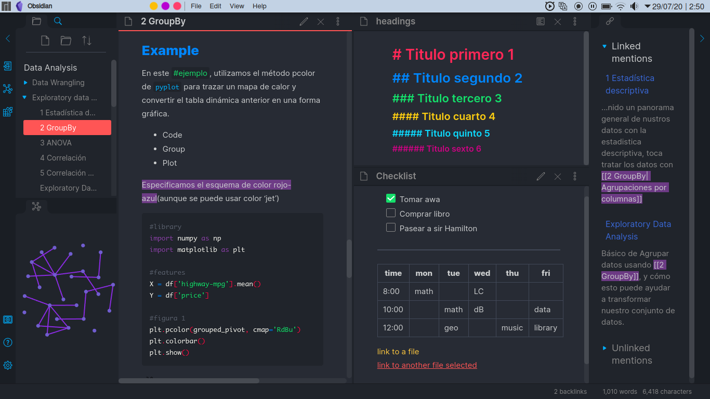
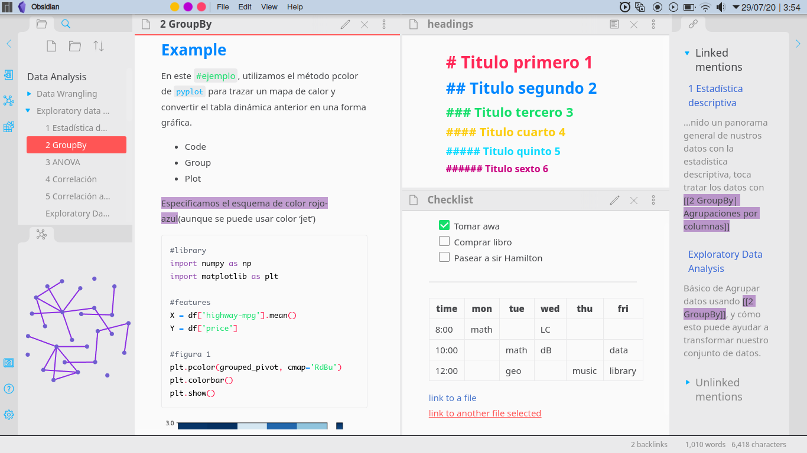

# Adria, a dark/light theme for [Obsidian.md](https://obsidian.md/)

A theme for Obsidian that is colorful as a Dinosaur. Originally based on [T-rex syntax](https://atom.io/packages/t-rex-syntax) Atom theme.

## Install

- Download obsidian.css to your Obsidian vault folder.
- Paste it to your Obsidian vault folder.

## Licence

I think it's licensed under [The Unlicense](./LICENSE). So enjoy!
